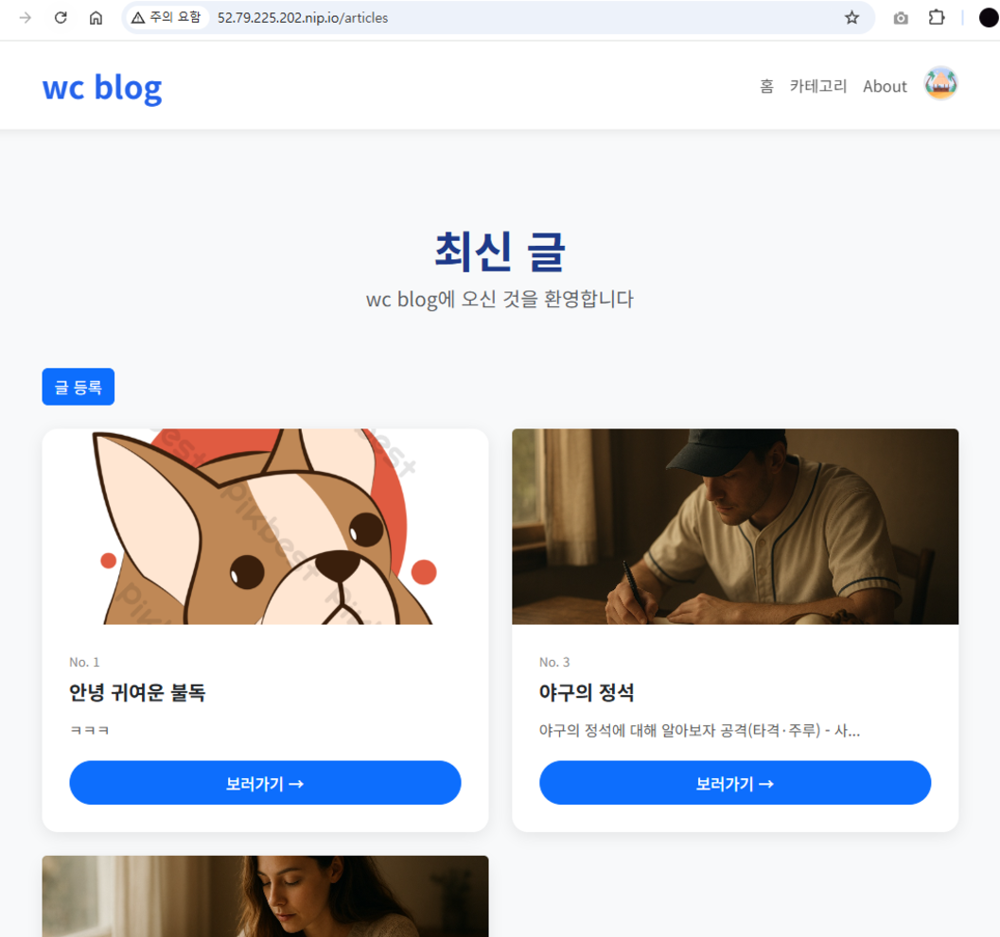
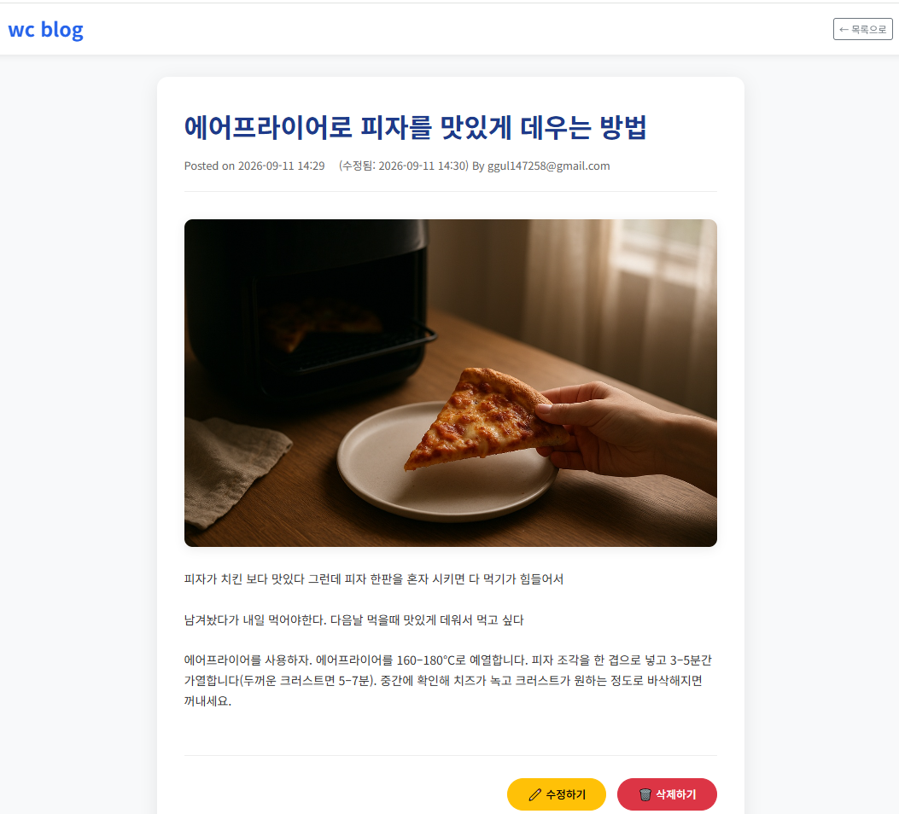
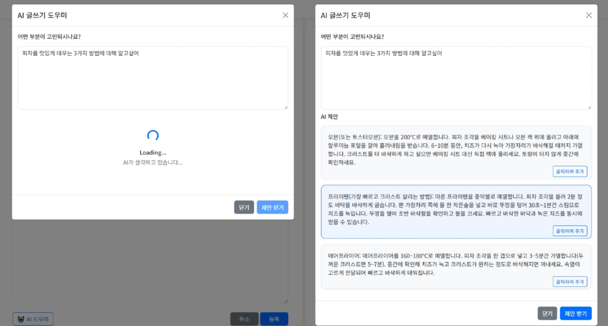
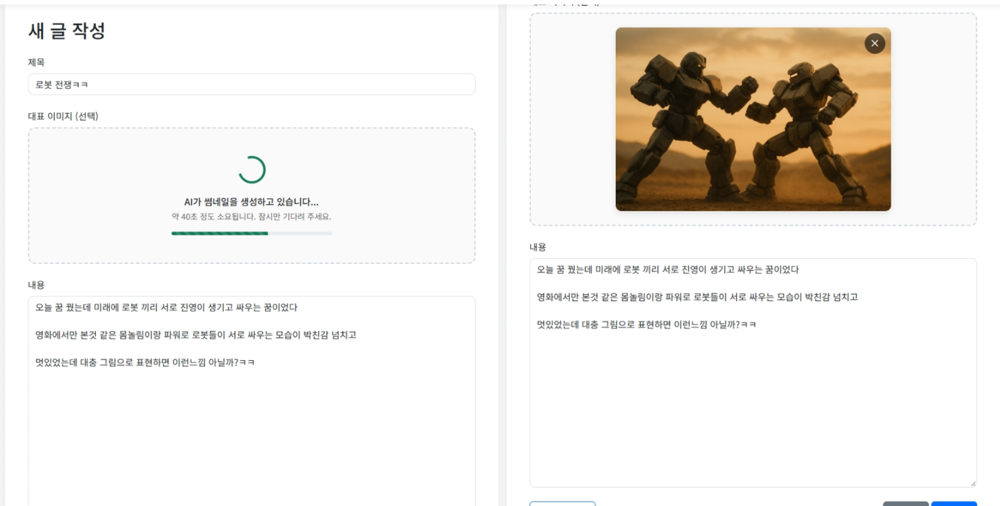
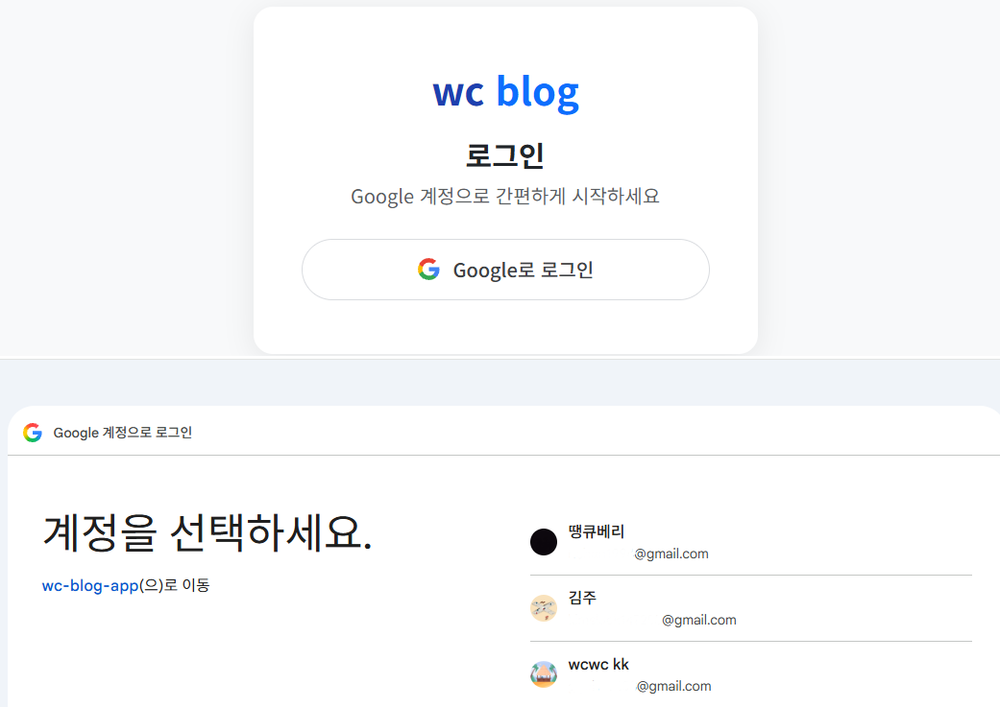
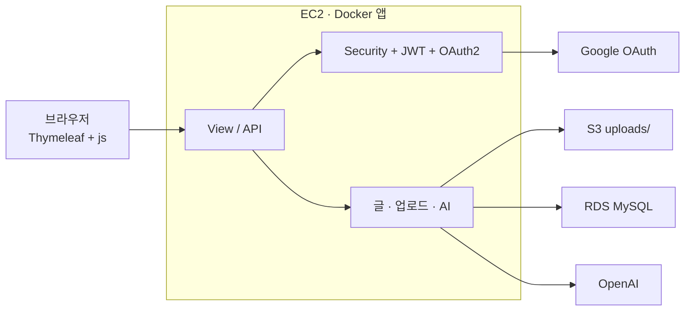

# wc blog

Spring Boot + Thymeleaf 개인 블로그.  
글 CRUD에서 시작해 이미지 업로드, Spring AI, JWT, Google OAuth2까지 확장한 후에 **S3 · RDS · EC2 Docker · GitHub Actions**로 배포했다.

- 저장소: https://github.com/wc321/blog-test

---

## 화면

| 목록 | 상세 |
|------|------|
|  |  |

| AI 글쓰기 도우미 | AI 썸네일 |
|------------------|-----------|
|  |  |



---

## 구조

### 요청 흐름


## 스택

| 영역 | 사용 |
|------|------|
| Backend | Java, Spring Boot 4, Spring MVC, Spring Data JPA, Spring Security 6 |
| View | Thymeleaf, Bootstrap 5.3, vanilla JS (`fetch`) |
| Auth | Form Login → JWT (Access + Refresh) → Google OAuth2 |
| AI | Spring AI (Chat / Image) |
| Storage | local: 디스크 + H2 · deploy: S3 + RDS MySQL |
| Infra | Docker (멀티스테이지), Docker Hub, Ubuntu EC2, GitHub Actions |

---

## 기능

- 글 목록 / 상세 / 작성·수정 겸용 폼 / 삭제 (`fetch` DELETE)
- 대표 이미지 업로드, 목록·상세 썸네일
- AI 글쓰기 도우미 (`POST /api/ai/suggest`) — 제안 3개, 클릭 시 본문 추가
- AI 썸네일 (`POST /api/ai-thumbnails`) — **생성은 base64만**, 저장은 글 확정 때 `/api/upload`
- 저장 전 `compressAndConvertToFile` (최대 1280px, JPEG 약 900KB) — 업로드 1MB 제한 유지
- Google 로그인 후 Access는 `localStorage`, Refresh는 쿠키, API는 Bearer
- 작성자만 수정·삭제

---

## 배포

```
main push
  → GitHub Actions
  → Docker Hub (wcwc123/wcblog:latest + sha)
  → EC2  SSH  docker compose pull && up -d
       ├─ 80:8080
       ├─ .env (DB / JWT / OAuth / OpenAI / SPRING_PROFILES_ACTIVE=dev)
       ├─ IAM Role → S3
       └─ JDBC → RDS MySQL (같은 VPC, SG 3306)
```

---

## 브랜치

기능 단위 `feature/*` + GitHub PR Squash Merge

```
feature/blog-thymeleaf-views
feature/spring-ai-blog-assistant
feature/image-upload
feature/ai-thumbnail-generator
feature/spring-security-auth
feature/jwt-auth
feature/oauth2-google-login
```
